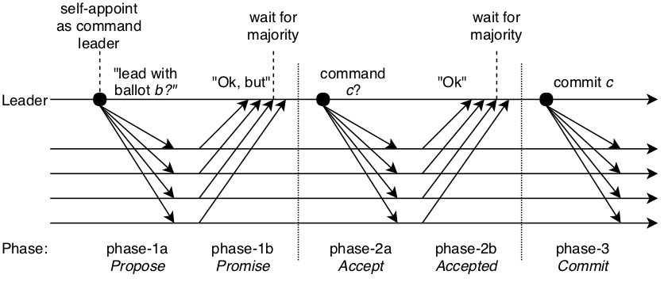
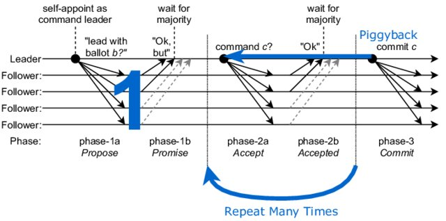
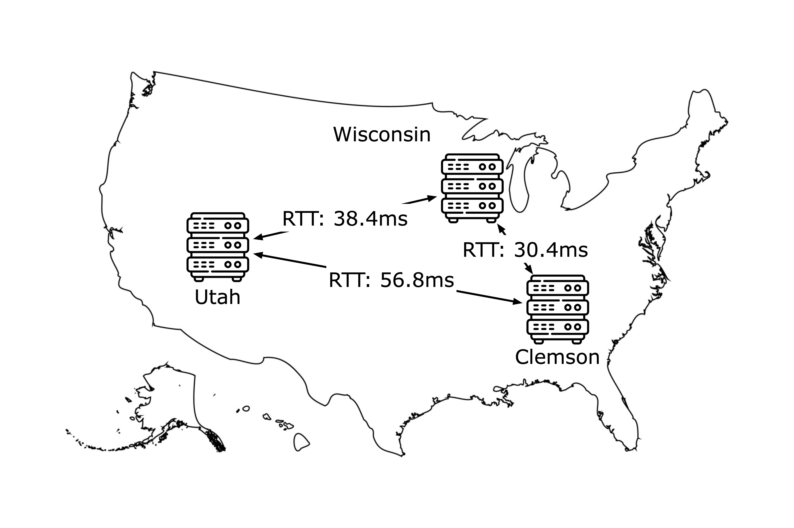
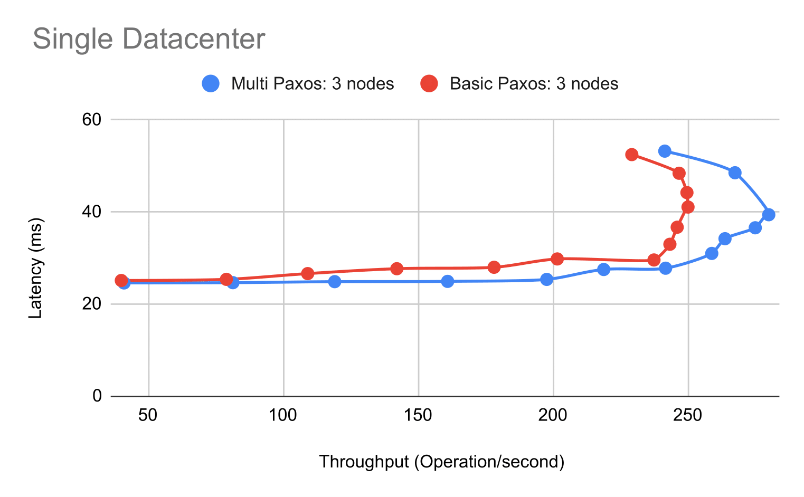
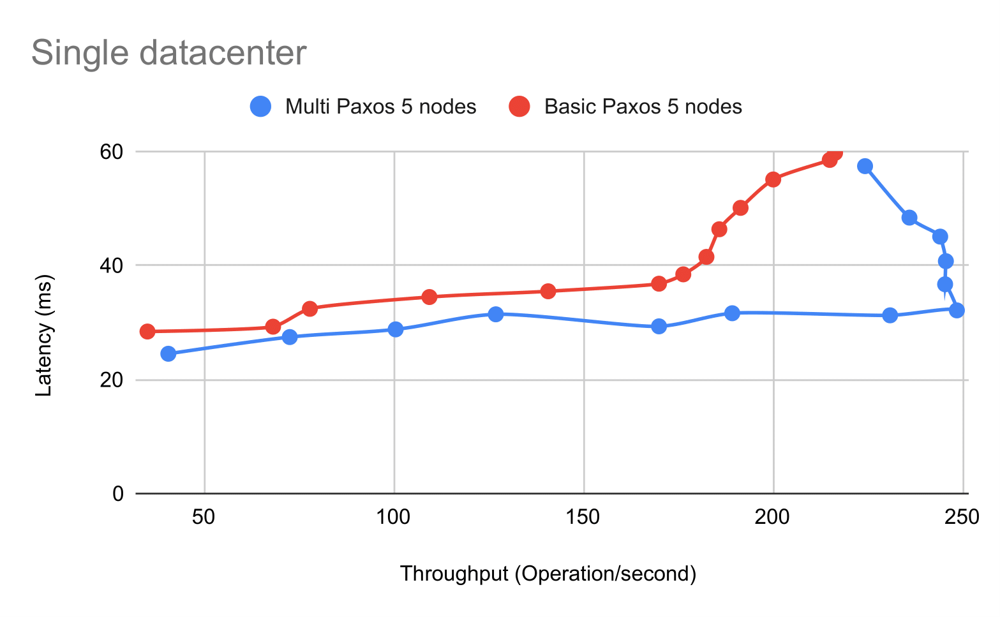
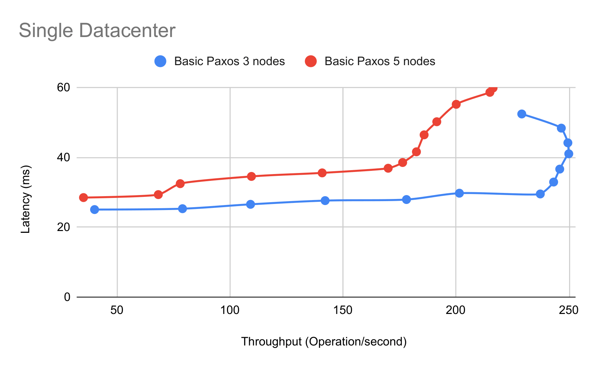
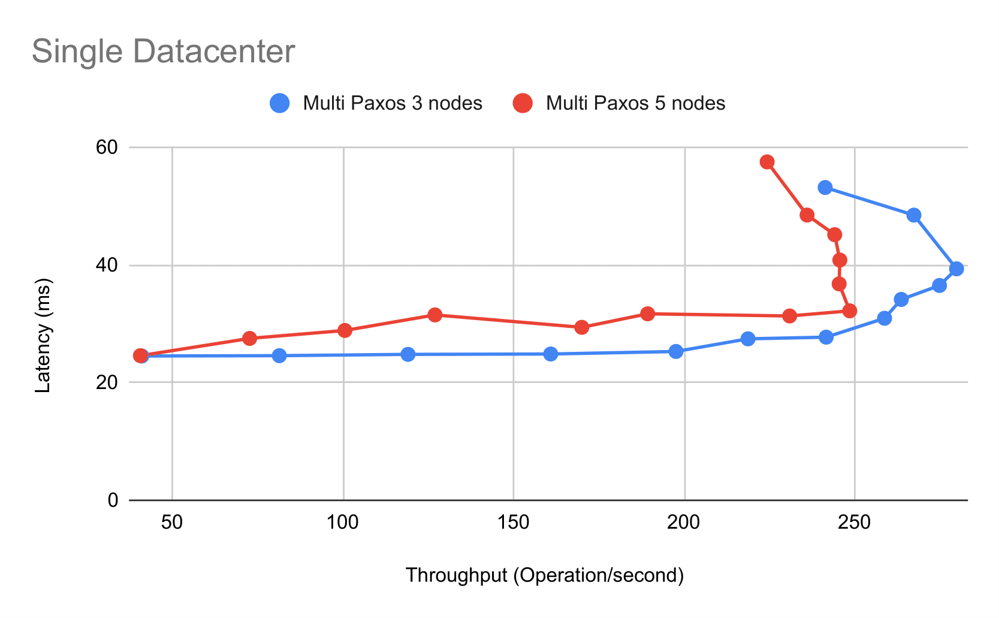

# Implementing and Comparing Paxos and Multi-Paxos

## Introduction

Distributed consensus is a cornerstone for distributed systems and applications. 

Among all the consensus protocols, Paxos is one of the main protocols for solving consensus in a network of distributed, unreliable nodes. With a consensus protocol, all processes in the system eventually agree on a single value after one or more processes propose this value. The Basic Paxos algorithm builds consensus on a single value.

Multi-Paxos is a optimized variant of Paxos when Paxos runs in consecutive rounds, which usually happens when a distributed system needs to reach consensus on a sequence of numbers. By electing a leader only when the leader fails (i.e., only when needed), we can reduce the two-phase process into a one-phase process, which reduces the number of messages that needs to be exchanged and improves latency.

In this project, we implement Paxos, Multi-Paxos as well as a key/value store system from scratch using Go in 3563 lines of code. We open-source our implementation at https://github.com/dywsjtu/Multi-Paxos.

## Background

### Paxos

There are three main roles in Paxos: `proposers` propose values, `acceptors` accept values if a majority accepts the value, and `learners` learn the chosen value. In reality, a process can play any or all of the roles.

The Paxos algorithm is divided into two phases for all processes to reach an agreement: the `propose` phase and the `accept` phase. At a high level, in the propose phase, the proposer contacts all processes in the system and asks them if they will promise to consider its value. Once a proposer has received promises to its requests from a quorom/a majority of the acceptors, we enter the accept phase, where the proposer sends a proposed values to acceptors. If a quorum of processes accepts this value, then the value is chosen. In practice, there is a third phase, the commit phase, that lets all replicas know that a value has been chosen.



At a detailed level, in the propose phase, the proposer selects a unique propsal number `n` that is greater than any `n` it has previously sent, and different from all other proposal numbers the system has previously used. The proposer then sends a `PREPARE` request that is associated with this proposal number n to a majority of the acceptors. Once the acceptor receives a `PREPARE` request, it checks whether the incoming proposal number is greater than any other proposal number it has previously received. If so, then the acceptor responds with a promise that indicates no other proposal with a smaller number can make it to consensus.

Following that, once the proposer receives promises from a majority of acceptors, we enter the accept phase to have the acceptors accept that proposal. Otherwise, a new round of Paxos has to be started. In the accept phase, the proposer first sends a `PROPOSE` message to a majority or all of the acceptors. When an acceptor receives a `PROPOSE` message, it always accepts the proposal unless it has already promised not to in the propose phase. When the proposer receives a majority of accept messages, it knows that consensus has been reached on the value.

### Multi-Paxos

When we need to have processes in a distributed system reach consensus on a sequence of numbers, the naive approach is to run multiple rounds of Paxos, since one round of Paxos results in the decision of a single value. As shown in the figure below, one optimization when we run Paxos for consecutive rounds is to assume a stable leader across rounds, therefore eliminating the need to do the propose phase (phase-1) in subsequent rounds of Paxos after determining a leader. In subsequent rounds of Multi-Paxos, the proposal number `n` used in the original `PREPARE` message is inherited by the following accept phases (phase-2). Moreover, phase-3 is piggybacked to the next phase-2, further reducing the communication overheads. All `PROPOSE` messages are attached with an additional parameter that indicates the sequence number (i.e., the current round). In the worst case where the leader is unstable, Multi-Paxos gracefully degrades to the Basic Paxos algorithm.



## Implementation

We implement Paxos, Multi-Paxos, as well as a key-value storage system from scratch using Go in 3563 lines of code. We will walk through our implementation and some important design choices in this section. For more details, please refer to our code.

### Basic Paxos

In Basic Paxos, each Paxos instance acts as a proposer, an acceptor, as well as a learner.  

```text
proposer(v):
  while not decided:
    choose n, unique and higher than any n seen so far
    send prepare(n) to all servers including self
    if prepare_ok(n, n_a, v_a) from majority:
      v' = v_a with highest n_a; choose own v otherwise
      send accept(n, v') to all
      if accept_ok(n) from majority:
        send decided(v') to all
      else:
        sleep(10ms)

acceptor's state:
  n_p (highest prepare seen)
  n_a, v_a (highest accept seen)

acceptor's prepare(n) handler:
  if n > n_p
    n_p = n
    reply prepare_ok(n, n_a, v_a)
  else
    reply prepare_reject
```

As shown in the above pseudocode, for the first phase: `Prepare Phase`, the proposers will send prepare messages along with a proposal number `n` to all acceptors. Acceptors will track the highest proposal number seen `n_p`, and only accept prepare messages with higher proposal numbers. If a proposer is approved by a majority of the acceptors and there is no accepted value, it will proceed to the next round with its own value, otherwise it will use the value `v_a` accepted with the highest `n_a`. In order to avoid the livelock issue, we make proposers sleep for a short amount of time after failing the prepare phase.  

```text
acceptor's accept(n, v) handler:
  if n >= n_p
    n_p = n
    n_a = n
    v_a = v
    reply accept_ok(n)
  else
    reply accept_reject
```

For the second phase: `Accept Phase`, the acceptors will only accept messages with higher propose numbers compared to `n_p` and update `n_a` and `v_a` accordingly.  

After being accepted by the majority of acceptors, proposers can broadcast the decided value to all replicas.  

### Multi-Paxos

The `Accept Phase` and `Learn Phase` are the same as those in Basic Paxos. The fundamental difference between Basic Paxos and Multi-Paxos is the presence of a leader. Instead of having a leader for each log slot, Multi-Paxos elects a leader for the whole log, which allows the leader to skip the first `Prepare Phase`.  

#### Pick a leader

Our implementation maintains a ballot number at each replica, and the `Accept Phase` and `Learn Phase` will use this number to replace the proposal number in Basic Paxos. In the beginning, we designate a leader. The leader will send out heartbeart signals to its followers. A follower will monitor the leader's heartbeat and if it is missed for 4 times, it will launch an election and it needs to be accepted by the majority of replicas to be the new leader.  

#### Consistency

If only the leader can run the prepare phase, then we can run it once for the whole log (not for every single log entry), which means we can then eliminate all prepare phases. So when a message comes in, the leader just runs the "accept" phase, reducing the number of exchanged messages by half.  

However, the goal of the `Prepare Phase` is twofold:

* Blocking older proposals
* Finding out possible chosen values

In order to guarantee strong consistency, we must solve these two problems. The first one is automatically addressed by having a monotonically increasing ballot number. For the second one, we need to ensure that the current leader can discover and respect the previous decided value. Hence, during the election, the followers need to provide their highest accepted log sequence number. For sequence number less than that, the leader can't skip the `Prepare Phase`.  

### KV Storage System

Our KV storage system support GET, PUT, and APPEND operations. The client is close-loop, and will send requests to all replicas in a round-robin manner. For the server side, it can detect duplicated requests. Our storage system provides sequential consistency to applications that use our client interface. A `Client.Get()` should see the value written by the most recent `Client.Put()` or `Client.Append()` (in that order) to the same key. We use Paxos to agree on the order of operations.  

```text
to := 10 * time.Millisecond
for {
    status, _ := kv.px.Status(seq)
    if status == Decided {
        ...
        return 
    }
    time.Sleep(to)
    if to < 10 * time.Second {
        to *= 2
    }
}
```

## Evaluation

In the section we will evaluate our system in iterm of correctness and performance. 

### Correctness Evaluation

We develop our test cases atop those provided in http://nil.csail.mit.edu/6.824/2015/.

| Test name | Description |
| ----------- | ----------- |
| TestBasic | Basic correctness, single/multiple proposers, same/different values, out-of-order instances |
| TestForget | Whether Paxos forgets logs |
| TestManyForget |  Whether Paxos forgets logs efficiently with high request rate |
| TestForgetMem | Whether Paxos forgetting actually frees the memory |
| TestRPCCount | Number of RPCs for each agreement |
| TestMany | Many agreements, without failures |
| TestOld | A peer starts up, with proposal, after others decide |
| TestManyUnreliable | Many agreements, with unreliable RPC |
| TestPartition | Shouldn't proceed with minority and should be able to recover after heal. One peer switches partitions, with unreliable RPC |

### Performance Evaluation

<!-- We evaluate our kv storage system based on Basic Paxos and Multi Paxos on 3 and 5 real cloudlab nodes. We only evaluate single datacenter setup. Even though we plan to evaluate wild area setup, the system implementation is relatively heavy and we were not able to conduct more thorough evaluation.  -->

We evaluate our kv storage system based on Basic Paxos and Multi Paxos on 3 and 5 real CloudLab nodes. We only evaluate single datacenter setup. The RTT between clients to the datacenter is 20ms.  We were planning to set up a wide-area distributed group using CloudLab nodes in different physical clusters (e.g., Clemson, Utah, and Wisconsin). Unfortunately, we ran into a technical challenge: even though the inter-node RTT is in the order of tens of miliseconds, we observe drastically higher-than-expected latency and reduced throughput. Invesitigating the underlying reason is ongoing work -- we are suspecting that the high latency is due to unexpected network conditions between these datacenters.



#### Basic Paxos vs. Multi Paxos

In this subsection, we evaluate Basic Paxos and Multi Paxos in terms of throughput and latency. We start from one close-loop client and gradually increase to 13 clients. For each of these 13 experiments, we record the throughput and latency in the steady state and we plot the results for Basic Paxos and Multi Paxos under the 3-node setting. 



We can observe that Basic Paxos yields higher latency, which is as expected since Multi Paxos can idealy skip the first phase. The less intuitive thing is that the maximum throughput of Multi Paxos is higher than that of Basic Paxos, since for Multi Paxos, only the leader can handle requests, while every node in Basic Paxos can handle requests. However, the pitfall of multiple leaders is that, naturally, the number of conflicts is higher compared to using a single leader, and thus the system handles more conflicts, which hurts the throughput performance.


For the 5-node setting, we have a similar observation: Basic Paxos has higher latency and Multi Paxos has higher maximum throughput.

For the both plots, we can also obeserve a clear speration of state.

* With less than 5 close-loop clients, our system is underloaded. We can observe that latency is not changing much as throughput increases.
* After reaching the maximum throughput, our system is overloaded and we can obeserve as the latency goes up, throughput is going down. For example, 250 operations/second for the 3-node Basic Paxos setting.  

#### 3 nodes vs. 5 nodes

In this subsection, we try to invesigate how our system performs when the number of nodes scales up. We evaluate both Basic Paxos and Multi Paxos in 3 and 5 nodes respectively that are co-located in the same CloudLab datacenter. We observe that, as expected, the latency in the 5-node setting is higher than that in the 3-node setting under the same throughput.



We can also obeserve that in both Basic Paxos and Multi Paxos, the 3-node setting has a higher maximum system throughput compared with the 5-node setting. It's as expected, since the communication cost of this system almost doubled.  



We also measure the number of RPCs for Multi Paxos and Basic Paxos. We find that when our system is underloaded, Multi Paxos has strictly fewer RPCs compared with Basic Paxos. However, when our system is extremely overloaded, they could have comparable number of RPCs. For Basic Paxos, it's mainly due to conflicts. For Multi Paxos, it's because that the leader changes pretty fast.

## Conclusion

In this project, we implemented and evaluated Basic Paxos and Multi Paxos, and observed that Multi Paxos indeed performs better than Basic Paxos in terms of throughput and latency in most cases. We also learned valuable lessons: for example, we found that simulations almost always have fidelity issues, and real deployment matters.

## References

- [Paxos/Multi-paxos Algorithm](https://amberonrails.com/paxosmulti-paxos-algorithm)
- [Understanding Paxos](https://people.cs.rutgers.edu/~pxk/417/notes/paxos.html)
- [Multi-Paxos](https://www.beyondthelines.net/algorithm/multi-paxos/)
- [Paxos, Raft, EPaxos: How Has Distributed Consensus Technology Evolved?](https://www.alibabacloud.com/blog/paxos-raft-epaxos-how-has-distributed-consensus-technology-evolved_597127)
- [PigPaxos: Devouring the Communication Bottlenecks in Distributed Consensus](https://dl.acm.org/doi/10.1145/3448016.3452834)
- [MIT 6.824: Distributed Systems](https://pdos.csail.mit.edu/6.824/)

